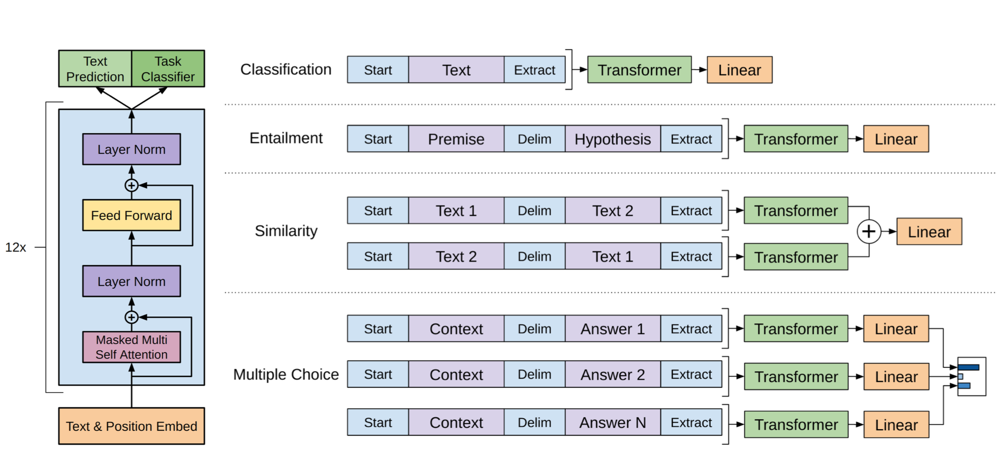

# NLP-GPT-Upsampling
This repository contains an implementation of [Open AI's GPT Model](https://openai.com/blog/better-language-models/). In particular, this implementation takes inspiration from the [Nystromformer](https://arxiv.org/abs/2102.03902) implementation to approximate the full attention softmax matrix to model longer sequences in NLP language modeling tasks by a simple strided average pooling of the input text sequence to reduce the sequence length. The reduced length attention output is then upsampled back to the original sequence length using the bilinear method.

It should be noted that due to the simplicity of this implementation, the performance of the model will not be comparable to the original GPT model utilising the full attention matrix. The tradeoff is that this naive strided averaging would be able to model longer sequences as compared to the original GPT implementation.


Fig. 1: GPT Model Architecture (obtained from [GPT paper](https://cdn.openai.com/research-covers/language-unsupervised/language_understanding_paper.pdf))

# Data
This repository includes codes to process the [Movie Dialogue](https://www.cs.cornell.edu/~cristian/Cornell_Movie-Dialogs_Corpus.html) dataset, where the preparation of the data follows this [script](https://github.com/suriyadeepan/datasets/blob/master/seq2seq/cornell_movie_corpus/scripts/prepare_data.py) closely, as well as the Reddit Jokes dataset](https://github.com/taivop/joke-dataset).

To prepare the data prior to training the model(s), run
```
python process_movie_dialogue_subword.py
```
for the Movie Dialogue dataset, or
```
python process_reddit_jokes_subword_v1.py
```
for the Reddit Jokes dataset.

# Training and Model Inference
Having processed the data into sub-word tokens, run
```
python train_movie_dialogue_sw_tf_ver2_gpt_keras_upsampled.py
python infer_movie_dialogue_sw_tf_ver2_gpt_keras_upsampled.py
```
or
```
python train_reddit_jokes_sw_tf_ver2_gpt_keras_upsampled.py
python infer_reddit_jokes_sw_tf_ver2_gpt_keras_upsampled.py
```
to train the respective models based on the dataset loaded and perform inference of the trained model.
